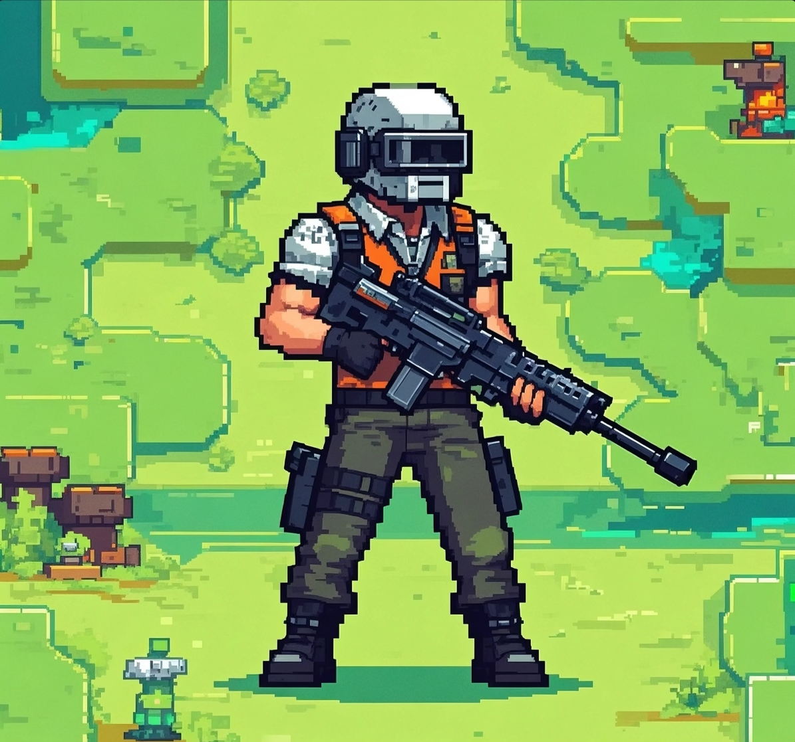

# SuroiFi - Blockchain Battle Royale Game on Solana

<div align="center">
  
  <p>Bringing Classic Battle Royale to the Blockchain World 🎮 ⛓️</p>
  <p>
    <a href="https://suroifi.top" target="blank">Official Website</a> ·
    <a href="https://x.com/SuroiFi" target="blank">Twitter</a> ·
    <a href="https://discord.gg/suroifi" target="blank">Discord</a>
  </p>
</div>

## 📖 Project Overview

SuroiFi is an innovative blockchain gaming project that transforms the classic open-source 2D battle royale game Suroi into a GameFi application on the Solana blockchain. We integrate NFTs, Play-to-Earn mechanics, and DAO governance to create a truly community-driven gaming ecosystem.

### 🌟 Core Features

- **Innovative Gameplay**
  - Fast-paced 2D combat system
  - Dynamic map generation
  - Tactical zone mechanics
  - Diverse weapons and equipment system

- **Blockchain Integration**
  - High-performance transaction system on Solana
  - NFT weapons and character skins
  - On-chain leaderboard and achievement system
  - Decentralized item marketplace

- **Economic System**
  - SUR token for in-game purchases and staking
  - Play-to-Earn reward mechanics
  - Community governance voting rights
  - Deflationary token economic model

## 🛠️ Technical Architecture

### Frontend Stack
```javascript
// App.jsx
import React from 'react'
import { ThemeProvider } from '@mui/material'
import { GameEngine } from './components/GameEngine'
import { Web3Provider } from './contexts/Web3Context'

function App() {
  return (
    <Web3Provider>
      <ThemeProvider theme={theme}>
        <GameEngine />
      </ThemeProvider>
    </Web3Provider>
  )
}
```

- **Core Framework**: React + Vite
- **UI Components**: Material-UI
- **State Management**: Redux Toolkit
- **Web3 Integration**: @solana/web3.js

### Backend Stack
```javascript
// server/src/index.js
import express from 'express'
import { Connection } from '@solana/web3.js'
import { initializeGameServer } from './game/engine'

const app = express()
const solanaConnection = new Connection('https://api.mainnet-beta.solana.com')

initializeGameServer(app, solanaConnection)
```

- **Server Framework**: Node.js + Express
- **Database**: MongoDB
- **Blockchain**: Solana SDK
- **Storage Solution**: IPFS + Arweave

## 🚀 Quick Start

### Requirements

- Node.js >= 16.0.0
- Rust >= 1.69.0
- Solana CLI tools
- MongoDB >= 5.0

### Installation Steps

1. Clone the project
```bash
git clone https://github.com/yourusername/suroifi.git
cd suroifi
```

2. Install dependencies
```bash
# Install frontend dependencies
cd client
npm install

# Install backend dependencies
cd ../server
npm install

# Build smart contracts
cd ../contracts
anchor build
```

3. Configure environment variables
```bash
cp .env.example .env
# Edit .env file to configure relevant parameters
```

4. Start development servers
```bash
# Start frontend server
cd client
npm run dev

# Start backend server
cd ../server
npm run dev
```

## 📚 Development Documentation

For detailed development documentation, please refer to:

- [System Architecture Design](./docs/ARCHITECTURE.md)
- [API Documentation](./docs/API.md)
- [Smart Contract Documentation](./contracts/README.md)

## 🤝 Contributing

We welcome community members to participate in project development! Please check our [Contribution Guidelines](CONTRIBUTING.md) for details.

### Development Process

1. Fork this repository
2. Create a feature branch (`git checkout -b feature/AmazingFeature`)
3. Commit your changes (`git commit -m 'Add some AmazingFeature'`)
4. Push to the branch (`git push origin feature/AmazingFeature`)
5. Submit a Pull Request

## 📄 License

This project is licensed under the MIT License - see the [LICENSE](LICENSE) file for details

## 🌐 Community Resources

- Official Website: [https://suroifi.top](https://suroifi.top)
- Twitter: [@SuroiFi](https://x.com/SuroiFi)
- Discord: [Join our community](https://discord.gg/suroifi)
- Email: contact@suroifi.com

## 🙏 Acknowledgments

- [HasangerGames](https://github.com/HasangerGames/suroi) - Original Suroi game
- Solana Foundation - Blockchain infrastructure support
- Our amazing developer community
- All game testers and early supporters

---

<div align="center">
  <p>Redefining Gaming Experience with Blockchain</p>
  <p>Made with ❤️ by SuroiFi Team</p>
</div>